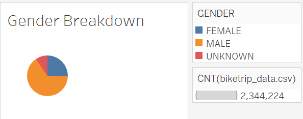
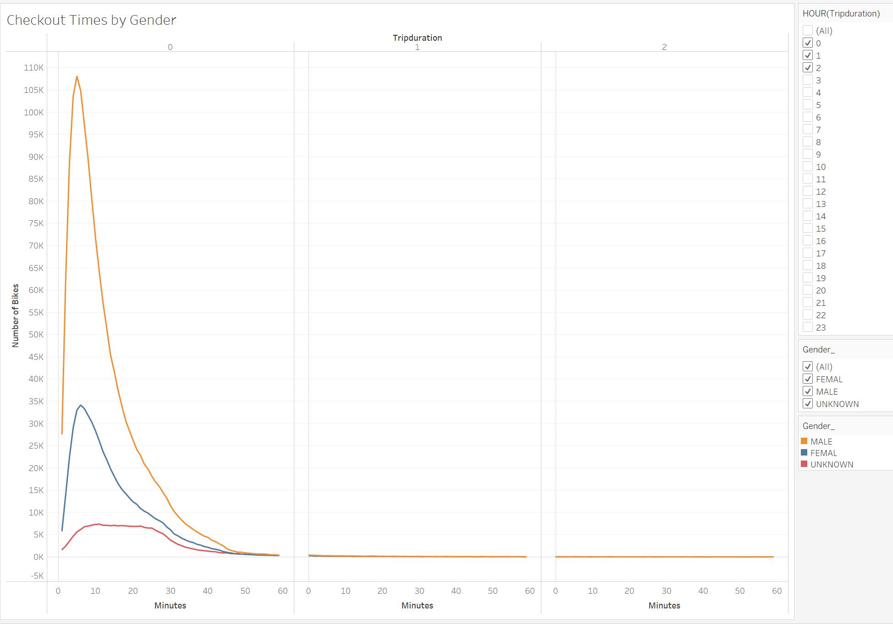
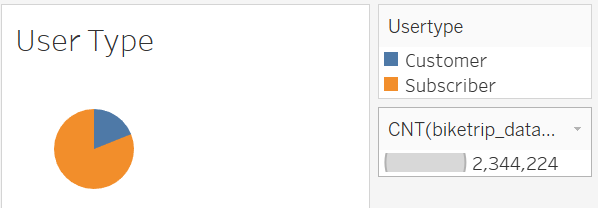
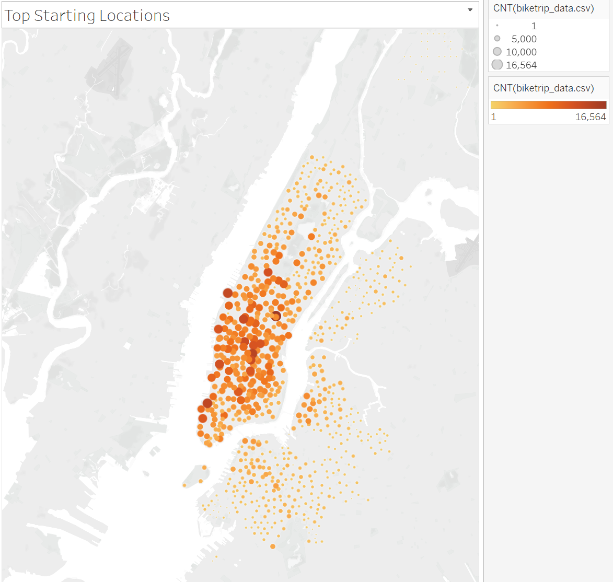
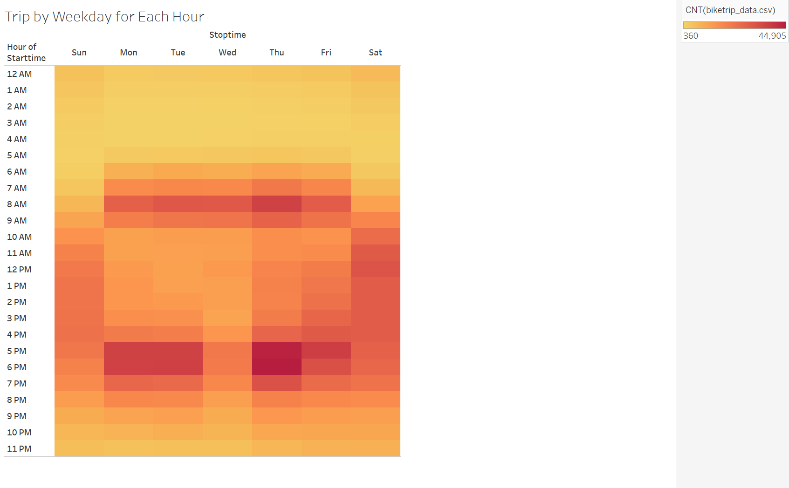
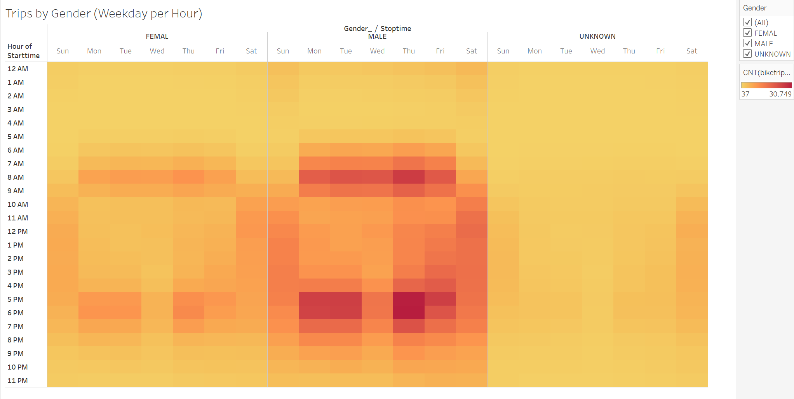
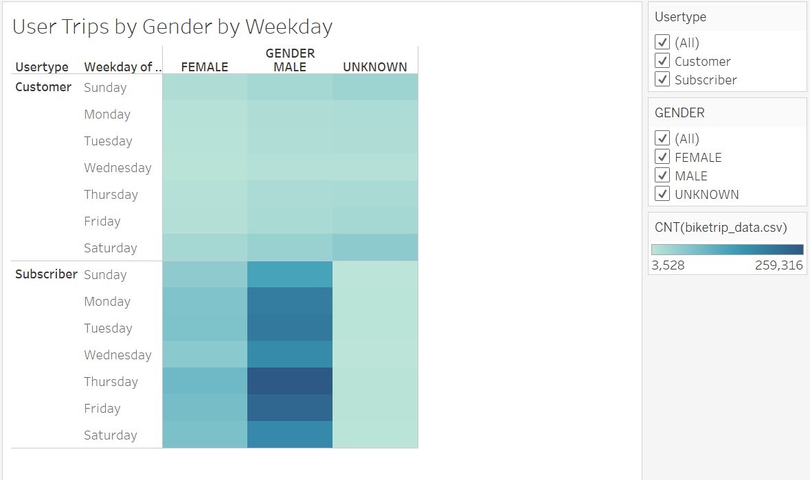

# NYC Ciitibike Analysis

## Overview of the Analysis
Analyzing data from Citibike bike-sharing program in New York City area, provide the visualization of bike trip data to convince investors about launching a bike-sharing program in Des Moines. In order to do so, we will make following visualizations:  

1. Show the length of time that bikes are checked out for all riders and genders
2. Show the number of bike trips for all riders and genders for each hour of each day of the week
3. Show the number of bike trips for each type of user and gender for each day of the week.

Lastly, we combine these visualizations into Tableau dashboards and stories as final presentations for investors.
## Resources
- Data Source: 201908-citibike-tripdata.csv from the website *Citi Bike System Data* URL: <https://www.citibikenyc.com/system-data>
- Software: Jupytor Notebook, Tableau Public

## Results:
Followings are the seven visualizations for the NYC Citibike analysis and desctiption for each visualization:

1. **Gender Breakdown**
- As shown on the visualizaion, we see that majority of Citibike users were male. Bemore specific with number, the breakdown is male: 1,530,272, felamle: 588,431, and unknown: 225,521. In percentae, male: 65.27%, female: 25.10%, and unknown: 9.62%.

2. **Checkout Times by Gender**
- The line diagram is displaying three different lines by gender. Although, the line for male is significantly bigger in terms of 'Number of Bikes,' the shape of lines are almost identical between male and female, which means both male and female tend to have similar characterstics in checkout times. Therefore, we do not see much reason to prefer certain gender over the other for checkout time.

3. **User Type**
- The pie chart shows that over 81% of customers are subscriber to the program and only 19% of the customers are non-subscriber. This result suggests that the business model should encourage users to sign up subscription and also provide service to maintain them to be successful.

4. **Top Starting Locations**
- The map plots starting station locations in NYC. Note that plotted points are differenciated by color and size based on their used counts. We can see that large dots are plotted mainly 50th street and below in Manhattan.

5. **Trips by Weekday for Each Hour**
- The heatmap displays how bike usage is populated by weekday for each hour. We can see that there are two peaks in weekdays around 7AM-9AM and 5PM-7PM while the peaktime is spread throughout the day for weekend. This means that users are often using for commute in weekdays and thus there are two peaks during those time frames.

6. **Trips by Gender (Weekday per Hour)**
- The heatmaps are adjusted from the previous visualization that the maps are separated by gender. Similar to what we saw for the **Checkout Times by Gender**, the gradation in heatmaps we see is almost identical among all genders. Thus, both male and femal rides bike in the same timeframes.

7. **User Trips by Gender by Weekday**
- The heatmap displays user trips separated by gender and by type of subscription. One thing we notice is that we have lot less 'unknown' subscriber compared to non-subscriber customers. This do make sense since people more likely to register their gender when they sign up as subscriber.

## Summary

